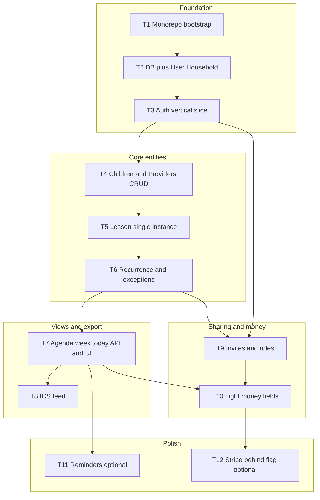

# Implementation Plan: Family Private Class Tracker (MVP)

**References:** [spec-family-private-class-tracker.md](./spec-family-private-class-tracker.md), [family-private-class-tracker.md](../ideas/family-private-class-tracker.md)

**Planning mode:** This document is the task breakdown only—no code until tasks are reviewed.

---

## Overview

Build the MVP as **vertical slices** (working end-to-end increments) on top of a **pnpm monorepo**: **Expo** mobile app + **Node** REST API + **PostgreSQL** via **Prisma**. Each phase ends in a **demoable** state and a **checkpoint** before the next phase.

---

## Architecture decisions (locked for this plan)

| Decision          | Choice                                                                                                                                                 | Rationale                                               |
| ----------------- | ------------------------------------------------------------------------------------------------------------------------------------------------------ | ------------------------------------------------------- |
| API style         | REST + JSON                                                                                                                                            | Matches spec; simple for mobile.                        |
| Auth transport    | Bearer JWT after login                                                                                                                                 | Stateless API; mobile stores token in secure storage.   |
| IDs               | UUID v4 for public IDs                                                                                                                                 | Safe for URLs and ICS tokens.                           |
| Lesson recurrence | DB: series row + override rows **or** single table with `recurrenceRule` + `exceptionOf`—**implement in Task 6** with simplest model that passes tests | Avoid premature complexity; document in ADR in that PR. |
| Money MVP         | Per-lesson `paymentStatus` enum + optional `creditBalance` on `Provider` or `Household`—**pick one in Task 10**                                        | Unblocks spec; align with product Open Question.        |

---

## Dependency graph

**Implementation order:** T1 → T2 → T3 → T4 → T5 → T6 → T7 → T8; then T9; then T10; T11–T12 optional for MVP exit per product.

---

## Task list

### Phase 1: Foundation

---

## Task 1: Monorepo bootstrap

**Description:** Create `pnpm` workspace with `apps/api`, `apps/mobile`, `packages/shared` (optional empty), root ESLint/TypeScript, and scripts for `lint`, `typecheck`, `test` (stub). No business logic yet.

**Acceptance criteria:**

- `pnpm install` succeeds at repo root.
- `pnpm lint` and `pnpm typecheck` succeed (may be no-op or minimal configs).
- `apps/mobile` runs `expo start` without errors (blank screen OK).
- `apps/api` starts an HTTP server on a port and returns `GET /health` → `200` JSON.

**Verification:**

- `pnpm lint` && `pnpm typecheck` at root.
- Manual: `curl` health endpoint.

**Dependencies:** None

**Files likely touched:**

- `package.json`, `pnpm-workspace.yaml`, `tsconfig.json`, `eslint.config.js`
- `apps/api/package.json`, `apps/api/src/index.ts` (or `server.ts`)
- `apps/mobile/package.json`, `app.json`, `App.tsx`

**Estimated scope:** Medium (3–5 files per app + root)

---

## Task 2: Database, Prisma, User + Household

**Description:** Add PostgreSQL connection, Prisma schema with `User`, `Household`, `HouseholdMember` (owner role), migrations, and API wiring to create user + household on registration (or separate endpoint—**one clear path**). Include docker-compose or README for local Postgres.

**Acceptance criteria:**

- `pnpm --filter api db:migrate` applies on empty DB.
- Prisma client generated in CI/local.
- At least one integration test: create `User` + `Household` + owner `HouseholdMember`.

**Verification:**

- `pnpm --filter api test` includes passing DB integration test (or `db push` in CI with test DB).
- Document `DATABASE_URL` in `apps/api/README.md`.

**Dependencies:** Task 1

**Files likely touched:**

- `prisma/schema.prisma`, `prisma/migrations/`*
- `apps/api/src/db.ts`, `apps/api/src/env.ts`
- `docker-compose.yml` (optional) or docs

**Estimated scope:** Medium

---

## Task 3: Auth vertical slice (register, login, mobile)

**Description:** Password (hashed) or magic-link MVP per spec; issue JWT; protect routes with middleware. Mobile: login/register screens, store JWT (expo-secure-store), attach `Authorization` header to API client.

**Acceptance criteria:**

- `POST /auth/register` creates user, household, owner membership, returns token.
- `POST /auth/login` returns token for valid credentials.
- `GET /me` or `GET /households/current` requires auth and returns household id.
- Mobile: user can register, relaunch app, still logged in (token persisted).

**Verification:**

- Integration tests for register/login and 401 without token.
- Manual: two flows on simulator.

**Dependencies:** Task 2

**Files likely touched:**

- `apps/api/src/auth/`*, `apps/api/src/middleware/auth.ts`
- `apps/mobile/src/lib/api.ts`, `apps/mobile/src/screens/Login.tsx`, `Register.tsx`
- `packages/shared` zod schemas for auth payloads (optional)

**Estimated scope:** Medium–Large (split magic-link to follow-up if needed)

---

### Checkpoint: Foundation

- `pnpm lint`, `pnpm typecheck`, `pnpm test` green.
- Demo: register → see “logged in” with household context.
- Human review before Phase 2.

---

### Phase 2: Core lesson domain (vertical)

---

## Task 4: Children and Providers CRUD

**Description:** API + mobile screens to add/edit/archive **children** and **providers** scoped to household. Validation with zod.

**Acceptance criteria:**

- CRUD endpoints under `/households/:id/children` and `.../providers` (or nested as spec prefers).
- Only members of household can access; return `403` otherwise.
- Mobile: list + create forms; archived hidden from default pickers.

**Verification:**

- Integration tests for happy path + 403.
- Manual: add two children and one provider.

**Dependencies:** Task 3

**Files likely touched:**

- `prisma/schema.prisma` (Child, Provider)
- `apps/api/src/routes/children.ts`, `providers.ts`
- `apps/mobile/screens/Children*.tsx`, `Providers*.tsx`

**Estimated scope:** Medium

---

## Task 5: Lesson — single instance only

**Description:** Create/read/update/delete a **non-repeating** lesson linked to child, provider, start/end UTC, location, notes. Mobile: form + detail screen.

**Acceptance criteria:**

- `POST /lessons` creates lesson; `GET/PATCH/DELETE` by id.
- Lessons scoped to household via child membership check.
- Mobile: create flow from home; lesson appears in a simple list.

**Verification:**

- Integration tests for CRUD + 404/403.
- Manual: create lesson, edit, delete.

**Dependencies:** Task 4

**Files likely touched:**

- `prisma/schema.prisma` (Lesson)
- `apps/api/src/routes/lessons.ts`, `services/lessonService.ts`
- `apps/mobile/screens/Lesson*.tsx`

**Estimated scope:** Medium

---

## Task 6: Weekly recurrence + exceptions

**Description:** Add recurrence (weekly minimum) and ability to edit/skip **one** occurrence. Centralize expansion logic in a testable module (e.g. `expandOccurrencesInRange`).

**Acceptance criteria:**

- API supports create with `recurrenceRule` and `seriesId` or equivalent; exception rows documented.
- Editing one occurrence does not change whole series without explicit UX (match PRD).
- Unit tests cover DST edge case **or** document limitation + single test for UTC storage.

**Verification:**

- `pnpm test` includes recurrence unit tests.
- Manual: weekly series shows 3 instances in list view.

**Dependencies:** Task 5

**Files likely touched:**

- `prisma/schema.prisma`, migrations
- `packages/shared/src/recurrence.ts` or `apps/api/src/domain/recurrence.ts`
- `apps/api/src/services/lessonService.ts`

**Estimated scope:** Large → **must** stay within focused files; split PRs if needed (schema first, then logic).

---

### Checkpoint: Core domain

- End-to-end: register → add child/provider → create recurring lesson → see multiple dates.
- Tests green.

---

### Phase 3: Views + ICS

---

## Task 7: Agenda, week, today queries + mobile UI

**Description:** Read-only queries for date ranges: **today**, **week**, **agenda** (next N days). Mobile: three tabs or stack screens with pull-to-refresh.

**Acceptance criteria:**

- `GET /lessons?from=&to=` or dedicated `/views/today` etc. returns expanded occurrences in range.
- Performance acceptable for ~50 lessons/week household (document pagination if needed).
- Mobile displays child, time, provider, location per spec.

**Verification:**

- Integration test with seeded recurring data.
- Manual screenshot for PR.

**Dependencies:** Task 6

**Files likely touched:**

- `apps/api/src/routes/views.ts` or extend `lessons.ts`
- `apps/mobile/screens/Agenda*.tsx`, navigation

**Estimated scope:** Medium

---

## Task 8: ICS feed (signed URL)

**Description:** Per-household secret token; `GET /calendar/:householdId.ics?token=` returns `text/calendar`; events in UTC with correct DTSTART/DTEND; update reflects on refresh (document client cache TTL).

**Acceptance criteria:**

- Token rotation endpoint for owner only (optional v1: regenerate in settings).
- Invalid/expired token → `401`/`404` without leaking existence.
- `docs/calendar-subscribe.md` with Google/Apple steps.

**Verification:**

- Manual subscribe in one external calendar app; edit lesson; refresh shows change.
- No full feed URL in logs.

**Dependencies:** Task 7 (needs stable lesson expansion)

**Files likely touched:**

- `apps/api/src/calendar/ics.ts`, `routes/calendar.ts`
- `prisma/schema.prisma` (token field on Household)
- `docs/calendar-subscribe.md`

**Estimated scope:** Medium

---

### Checkpoint: Export

- Spec success row “ICS” demonstrable on staging.
- Human review.

---

### Phase 4: Sharing + money

---

## Task 9: Invites + roles + payment field visibility

**Description:** Invite by email token; second user accepts, becomes `Member`; `Owner` sees payment fields; `Member` does not (per spec—adjust if product changes). API enforcement + mobile UI hiding.

**Acceptance criteria:**

- `POST /invitations`, `POST /invitations/accept`.
- Role stored on `HouseholdMember`.
- Lesson payment fields stripped in JSON for member when rule says so.

**Verification:**

- Two-user integration test.
- Manual: second login cannot see money.

**Dependencies:** Task 3, Task 6 (lessons exist)

**Files likely touched:**

- `prisma/schema.prisma` (Invitation, role enum)
- `apps/api/src/routes/invitations.ts`
- `apps/mobile/screens/Invite*.tsx`

**Estimated scope:** Medium

---

## Task 10: Light money (MVP model)

**Description:** Implement **one** minimal model (recommend: per-lesson `paymentStatus`: `unpaid` | `paid` + optional `providerCreditBalance` integer on `Provider`). Owner-only write; member read per Task 9.

**Acceptance criteria:**

- PATCH lesson updates payment status; validation only for owner.
- Mobile: toggle or select on lesson detail for owner.

**Verification:**

- Integration tests owner vs member.
- Product sign-off on copy (“not accounting advice”).

**Dependencies:** Task 9

**Files likely touched:**

- `prisma/schema.prisma`, `apps/api/src/routes/lessons.ts`, mobile detail screen

**Estimated scope:** Small–Medium

---

### Checkpoint: MVP complete (spec)

- All rows in [spec Objective success table](./spec-family-private-class-tracker.md#objective) verified on staging.
- Lint/typecheck/test CI green.

---

### Phase 5: Optional (post-MVP or stretch)

---

## Task 11: Lesson reminders (push)

**Description:** Schedule notifications X minutes before lesson (Expo push); server cron or queue; idempotent per occurrence.

**Acceptance criteria:**

- User can enable/disable and pick offset from allowed list.
- No duplicate pushes for same occurrence after edit.

**Verification:**

- Manual on device; document limitations.

**Dependencies:** Task 7

**Estimated scope:** Large (infrastructure); **optional** for MVP.

---

## Task 12: Stripe (feature flag)

**Description:** Deposit or subscription via Stripe Checkout **web** or app flow per legal decision; feature flag off by default.

**Acceptance criteria:**

- No charge paths in dev without keys; staging test card works.
- Terms + privacy linked before pay.

**Verification:**

- Manual test mode; no keys in repo.

**Dependencies:** Task 10 (optional), legal checklist

**Estimated scope:** Large; **ask first** per spec boundaries.

---

## Parallelization

| Parallel A                | Parallel B                    | After         |
| ------------------------- | ----------------------------- | ------------- |
| Task 11 spikes (push)     | Docs / observability (Sentry) | Task 7 stable |
| Unit tests for recurrence | Mobile UI polish              | Task 6        |

**Do not parallelize:** Migrations (single thread); shared API contract changes (define first).

---

## Risks and mitigations

| Risk                       | Impact | Mitigation                                                  |
| -------------------------- | ------ | ----------------------------------------------------------- |
| Recurrence bugs (DST)      | High   | UTC storage; unit tests; document known limits              |
| ICS caching confuses users | Med    | Doc refresh behavior; short cache headers if needed         |
| JWT leakage on mobile      | High   | Secure storage only; short-ish expiry + refresh token later |
| Scope creep (sync, chat)   | High   | Refer to spec **Not Doing**; tickets for v2                 |

---

## Open questions (block or defer tasks)

- **Package model:** Resolve before Task 10 schema freeze.
- **Co-parent two-home:** If v1, add to Task 9 role matrix.
- **IAP vs web for Stripe:** Blocks Task 12 implementation details.

---

## Verification (planning skill checklist)

- Every task has acceptance criteria.
- Every task has verification steps.
- Dependencies ordered; graph matches.
- No task titled with vague “implement MVP”; slices are concrete.
- Checkpoints between phases.
- **Human reviewed and approved** before implementation starts.

